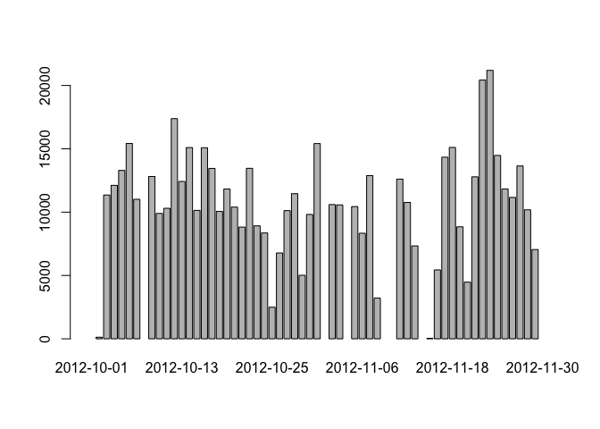
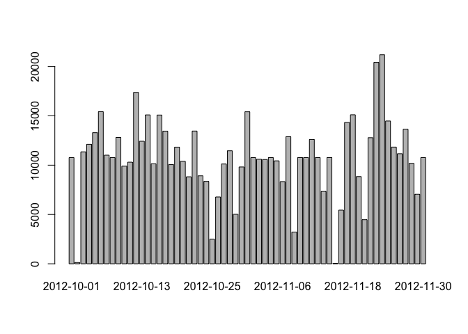

# Reproducible Research: Peer Assessment 1

## Loading and preprocessing the data
The R code below loads activity.csv into data frame **df1**.  Then the **date** column (column #2) is converted from the string type to Date datatype.


```r
df1 <- read.csv("activity.csv", stringsAsFactors = F)
df1[,2] <- as.Date(df1[,2])
str(df1)
```

```
## 'data.frame':	17568 obs. of  3 variables:
##  $ steps   : int  NA NA NA NA NA NA NA NA NA NA ...
##  $ date    : Date, format: "2012-10-01" "2012-10-01" ...
##  $ interval: int  0 5 10 15 20 25 30 35 40 45 ...
```

## What is mean total number of steps taken per day?
The R code below uses the **group_by** capability in the **dplyr** package to compute the total number of steps grouped by date:


```r
library(dplyr)
df1_grp_by_date  <- group_by(df1, date)
result_sum <- summarise(df1_grp_by_date, total_steps = sum(steps))
barplot(result_sum$total_steps, names.arg = result_sum$date)
```

 

Furthermore, using the result from above, the following R code computes the mean and median total number of steps taken per day:


```r
mean(result_sum$total_steps, na.rm=T)
```

```
## [1] 10766.19
```


```r
median(result_sum$total_steps, na.rm=T)
```

```
## [1] 10765
```

## What is the average daily activity pattern?

The R code below makes a time-series plot of the 5-minute interval (x-axis) and the average number of steps taken, averaged across all days (y-axis)


```r
df1_group_by_interval <- group_by(df1, interval)
result_mean <- summarise(df1_group_by_interval, mean_steps = mean(steps, na.rm = T))
ts1 <- ts(result_mean[,2])
plot(ts1)
```

 

The R code below shows that interval "835" is th  5-minute interval, on average across all the days in the dataset, contains the maximum number of steps (ie: 206.1698 steps)


```r
df1 %>%
  group_by(interval) %>%
  summarize(mean_steps = mean(steps, na.rm = T)) %>%
  arrange(desc(mean_steps)) %>%
  head(5)
```

```
## Source: local data frame [5 x 2]
## 
##   interval mean_steps
## 1      835   206.1698
## 2      840   195.9245
## 3      850   183.3962
## 4      845   179.5660
## 5      830   177.3019
```

## Imputing missing values

The R code below calculates the total number of missing values in the dataset:

```r
sum(is.na(df1[,1]))
```

```
## [1] 2304
```

The R code below replaces the missing values in df1$steps with the correponding mean of 5-minutes interval across all days as computed eariler.   The new version of df1 is stored in **df1_new**

```r
df2 <- merge(df1, result_mean, by="interval")
df1 <- data.frame(ifelse(is.na(df2$steps), df2$mean_steps, df2$steps ) ,
                 df2$date, df2$interval)
names(df1) <- c( "steps", "date", "interval")
```

Below is the histogram, mean, and median associated with the **new** df1:

```r
df1_grp_by_date  <- group_by(df1, date)
result_sum2 <- summarise(df1_grp_by_date, total_steps = sum(steps))
barplot(result_sum2$total_steps, names.arg = result_sum2$date)
```

 


```r
mean(result_sum2$total_steps)
```

```
## [1] 10766.19
```


```r
median(result_sum2$total_steps)
```

```
## [1] 10766.19
```

Note that the **mean** is the same as before (10766.19), while the **median** changed slightly (from 10765 to 10766.19).

The total number of steps across all days and intervals have increased after we replaces the missing values:


```r
sum(result_sum$total_steps, na.rm=T)
```

```
## [1] 570608
```

```r
sum(result_sum2$total_steps)
```

```
## [1] 656737.5
```

However, the way we replaced missing values result in the same mean, as well as causing median to converge to the mean.

## Are there differences in activity patterns between weekdays and weekends?

The R code below graphs the mean step counts of all the intervals across all dates factored by weekday vs weekend:


```r
df3 <- cbind(df1, ifelse(weekdays(df1$date) %in% c("Saturday", "Sunday"), 
                         "weekend", "weekday"))
names(df3)[4] <- "weekday"
df3$weekday <- factor(df3$weekday)

df3_group_by_interval <- group_by(df3, interval, weekday)
result_mean2 <- summarise(df3_group_by_interval, mean_steps = mean(steps, na.rm = T))

library(lattice)
xyplot( result_mean2$mean_steps ~ result_mean2$interval | result_mean2$weekday, 
        layout=c(1,2),
        type="l",
        xlab="interval", ylab="Number of steps")
```

 

The graph shows that on the weekend, the activity seems more evenly spread out throughout the 'waking' hours, while on the weekend, the activity spikes around the beginning of his waking hours.


